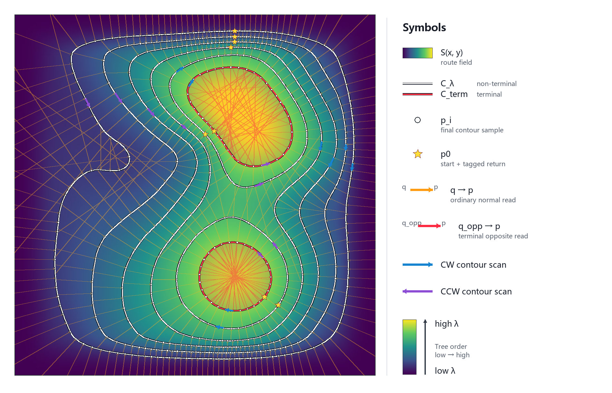

# TopoContour-Mamba

**Topology-Guided Visual Serialization with Augmented Contour Trees**  
**基于增广等高线树的拓扑引导视觉序列化**

## Repository purpose / 仓库用途

This repository provides a versioned public record of the initial TopoContour-Mamba architecture. It allows readers to inspect the bilingual manuscripts, route-construction rules, and visualization code, and provides a shared starting point for review, reproduction, and later implementation. The current release documents a proposed mechanism; public availability does not imply that its empirical performance has already been validated.

本仓库用于公开记录TopoContour-Mamba初版架构及其版本演进。读者可以查看中英文论文、路线构建规则和示意图代码，并以此作为审查、复现和后续实现的共同起点。当前版本记录的是一套待实验验证的完整机制；公开仓库并不表示其性能已经得到实证确认。

[English paper](output/pdf/TopoContour-Mamba-English.pdf) · [中文论文](output/pdf/TopoContour-Mamba-Chinese.pdf)

## English

### Overview

TopoContour-Mamba is an architecture study for turning an image-dependent structural field into a scan order for Mamba. Instead of using the same raster, cross, or window route for every image, it follows retained level-set contours and uses an augmented contour tree to organize their low-to-high aggregation. Local visual reading and global topology are kept separate: every contour is encoded independently from raw RGB samples, and only its tagged output enters the tree.

The current version specifies the complete mechanism and reference defaults. It does not claim empirical performance or include a full training implementation.

### Pipeline

1. **Build the route field.** Generate a deterministic saliency field from the RGB image, smooth it, and compute one shared Sobel field.
2. **Extract the topology.** Build the full contour tree, retain useful regular contours, and contract branches that contain no retained contour.
3. **Place adaptive samples.** Contour perimeter fixes the point budget; Sobel responses redistribute those points and select one loop-wide read side and a common anchor `p0`.
4. **Read each contour independently.** Normal Mamba scans from the first collision back to a tagged contour point. Two shared-weight Contour Mamba scans traverse the closed loop in opposite directions and return to the tagged anchor. Terminal contours additionally read both normal sides.
5. **Aggregate through the tree.** Tree Mamba processes tagged contour outputs from low to high saliency. Splits copy a summary, while joins use permutation-invariant, support-aware fusion.
6. **Produce the image representation.** Terminal leaves are ordered by saliency measured on their actual reads. A final Mamba produces the global vector `g`, which is passed to a linear classifier. An RGB-statistics projection handles the empty-route case.

## 中文

### 项目简介

TopoContour-Mamba研究如何把随图像变化的结构强度场转化为适合Mamba的扫描顺序。它不让所有图像共用固定的栅格、十字或窗口路线，而是沿保留的等高线读取图像，并利用增广等高线树组织从低显著性到高显著性的全局汇总。局部视觉读取与全局拓扑严格分开：每个轮廓直接读取原图RGB并独立编码，只有带Tag的轮廓输出进入树状汇总。

当前版本完整规定了架构、路线规则和参考默认值，但不声明实证性能，也暂未提供完整训练实现。

### 执行流程

1. **生成路线场：**从RGB图像生成确定性显著性场，完成平滑并计算一张所有轮廓共享的Sobel场。
2. **提取拓扑：**建立完整等高线树，保留值得扫描的常规轮廓，并收缩不含保留轮廓的树枝。
3. **自适应布点：**轮廓周长决定固定点数；Sobel响应负责重新分配采样点，并统一确定整圈的普通读取侧和公共起止点 `p0`。
4. **独立读取轮廓：**Normal Mamba从首次碰撞点反向读回带Tag的轮廓点；两个共享权重的Contour Mamba沿相反方向扫描同一闭环，并返回带Tag的公共起止点。终止轮廓额外读取法线两侧。
5. **沿树汇总：**Tree Mamba从低显著性向高显著性处理带Tag的轮廓输出；分裂时复制摘要，汇合时使用与输入顺序无关、考虑采样支撑量的融合。
6. **生成图像表示：**根据终止叶子实际读取区域的显著性确定顺序，最终Mamba输出全局向量 `g`，再交给线性分类头。没有有效轮廓时，使用RGB均值和方差的投影作为保底输出。

